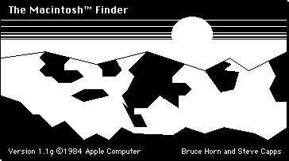

# May 7, 2025

I had been searching for an early "About the Finder" dialog on the internet. It was a mountainscape scene created in MacPaint and only used for a short time. ChatGPT helped me determine what versions of Mac OS and the Finder used it. It was used in System 1.1 and Finder version 1.1g and then pretty quickly dropped for a more standard "About..." dialog.

I booted into System 1.1 using the website [Infinite Mac](https://infinitemac.org) and took a screenshot of the picture. Then I imported it into Illustrator and recreated it as a vector using 1px by 1px vector squares, so the image will be pixel perfect at any size.